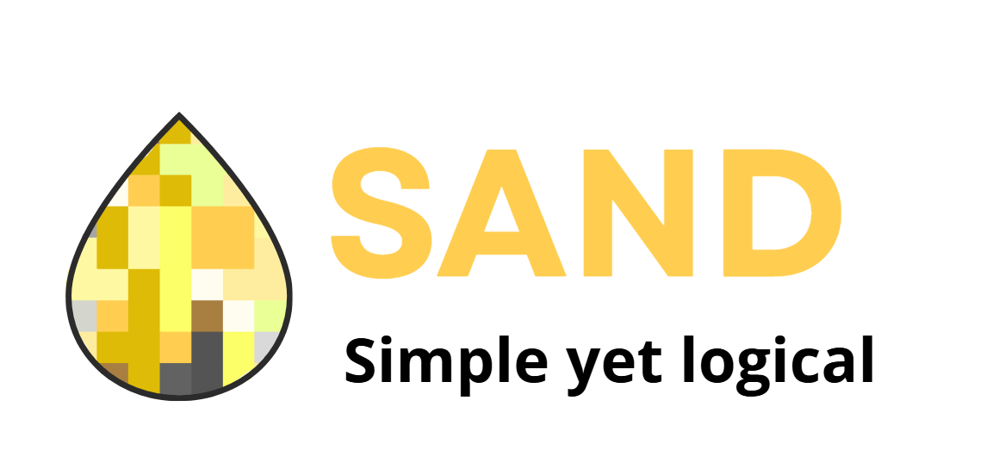

# Sand, A Markup Language
<sub>Prealpha 0.0.1</sub>

---

**Sand** is the Markup Language coming with the Gravel series. Sand provides a basic environment to write basic articles or websites.

## The Logic

Sand's logic is simple. Every line, can start with **three** characters, every one with a specific meaning.

| Character | Meaning  |
|-----------|----------|
| -         | A node   |
| /         | Attribute|
| .         | Literal  |

Nodes can be nested using indentation (four spaces, tab automatically translates to it). A nested attribute will be used when creating the HTML element. Attributes are defines in `/key=value`. 

Literals are a string of text. Every node handles literals ignoring them or using them in a specific way, like LIST node.

For literal blocks, In the future this will be available:
```
...
    I am a block
    Same thing
    We are all together
...

```

### After name value

Some nodes accept a value after its name (`-H1: ANV`). Every node uses it as described in the next chapter.

You can use every HTML attribute on every node.

## Available Nodes

* **CONTENT**: Main container for your code
  * ANV: None
* **H1-H6**: Headers
  * ANV: Text
* **TXT**: Paragraph
  * ANV: Text
* **BOX**: A container, like div
  * ANV: Id
* **LINK**: An hyperlink to another website or file
  * ANV: Link display name
* **IMG**: An image from a link
  * ANV: Image link
* **CODE**: Code line
  * ANV: Text
* **BTN**: A clickable, HTML button
  * ANV: Text
* **LINE**: Line.
  * ANV: None
* **LIST**: A list of literals
  * ANV: Type (bullet/number). You can also define it using `/type={bullet,number}`

## Example

### Sand: 

```
-CONTENT:
    -H1: Sand, a Markup Language
        /id=TITLE
        /class=main-header
    -H2: Why Sand?
    -H4: Because Sand is:
    -BOX: List
        -LIST: bullet
            .Structured as HTML
            .Readable as MD
            .Easy to write as YAML
    -H3: IMPORTANT: Sand has just been started being developed!
        /class=important
```

### Result:

<div><h1 id="TITLE" class="main-header">Sand, a Markup Language</h1>
<h2>Why Sand?</h2>
<h4>Because Sand is:</h4>
<div id="List"><ul>
<li>Structured as HTML</li><li>Readable as MD</li><li>Easy to write as YAML</li></ul>
</div>
<h3 class="important">IMPORTANT: Sand has just been started being developed!</h3>
</div>

## Changelog
**2026-07-11**:
- First Commit:
  - Nodes: H1-H6, TXT, CONTENT
  - Basic Transpilation and Documentation
  - Attribute and Node basic Parsing
- Add BOX Node
- Better Attribute Parsing
- Possibility to use tabs as four spaces
- Add LINK and IMG nodes

**2026-07-12**:
- Added LIST node
- Added literal support
- Fixed typos at README